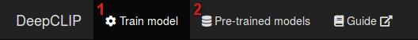
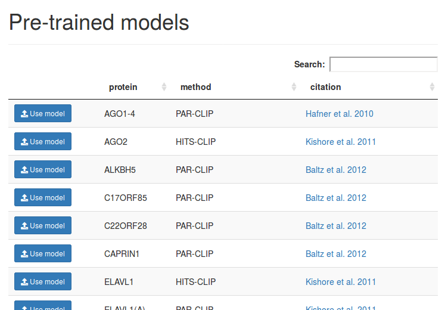
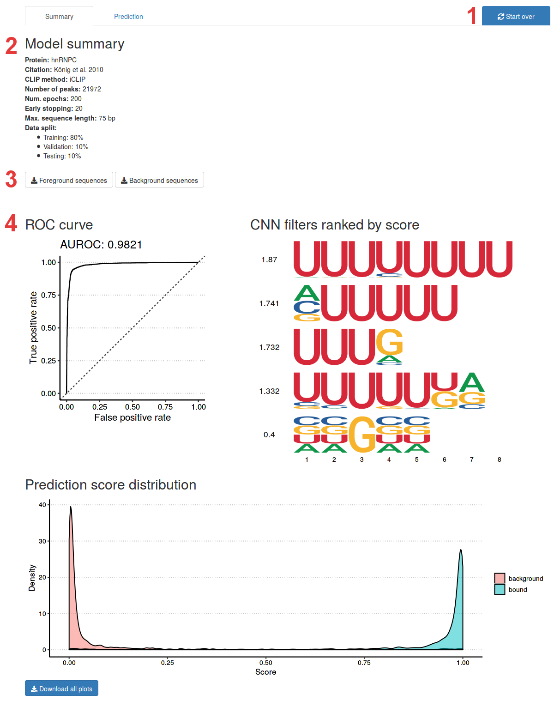
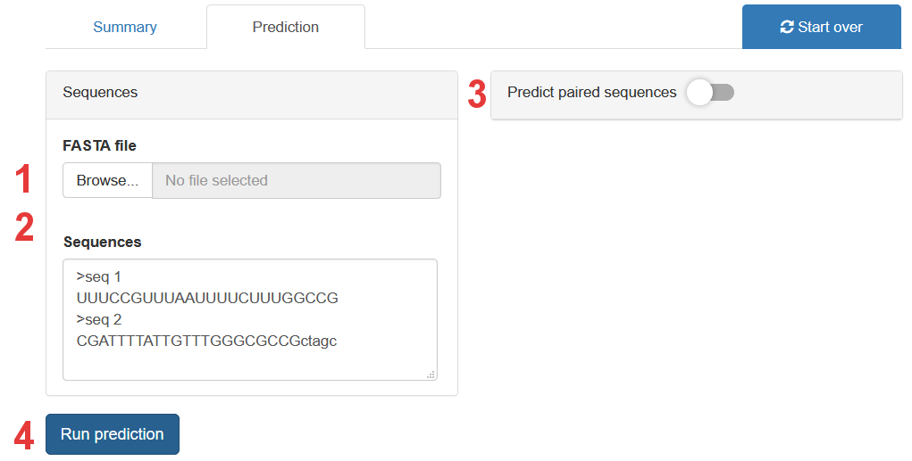
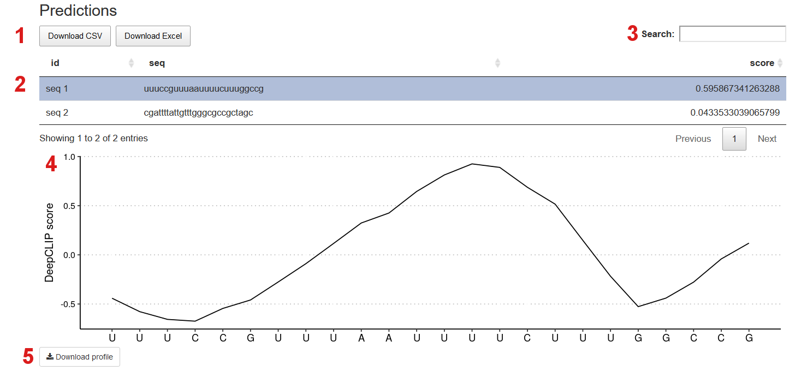
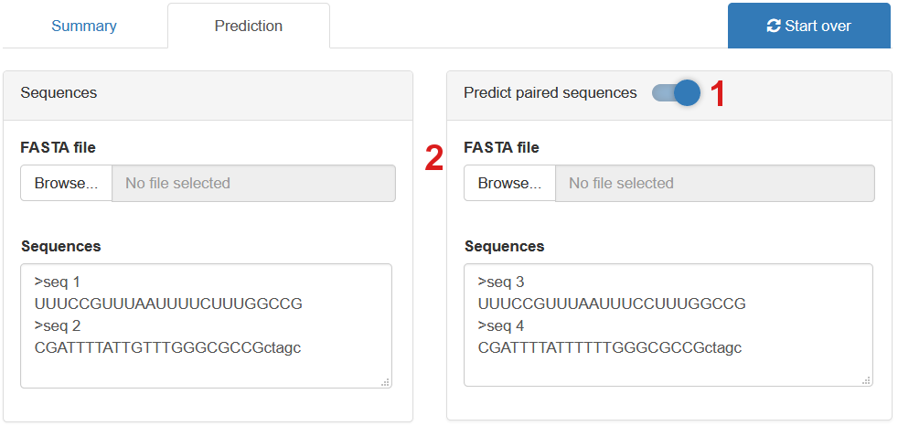
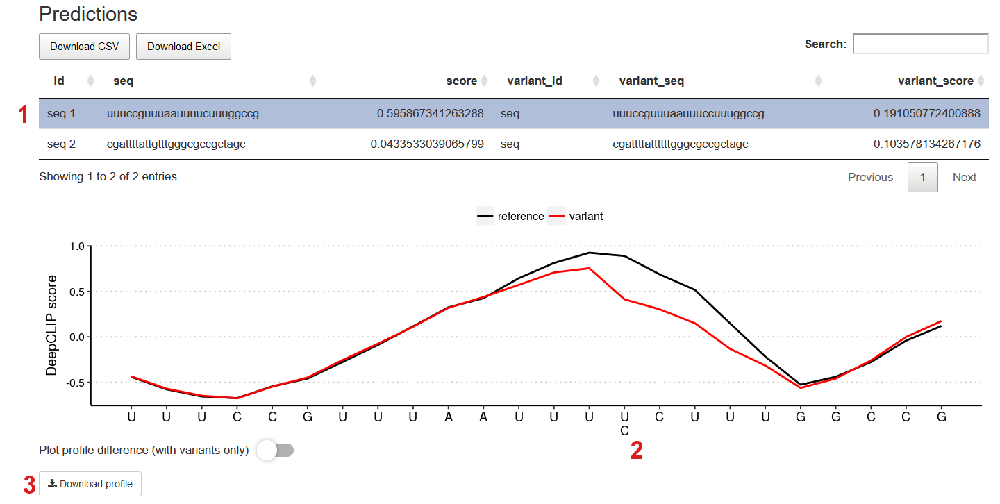
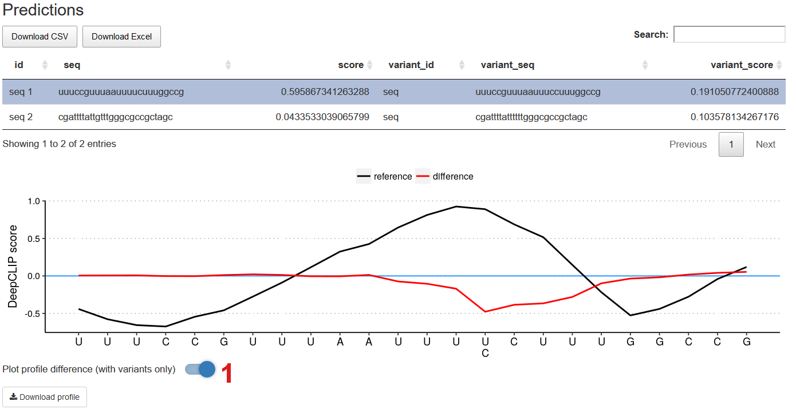
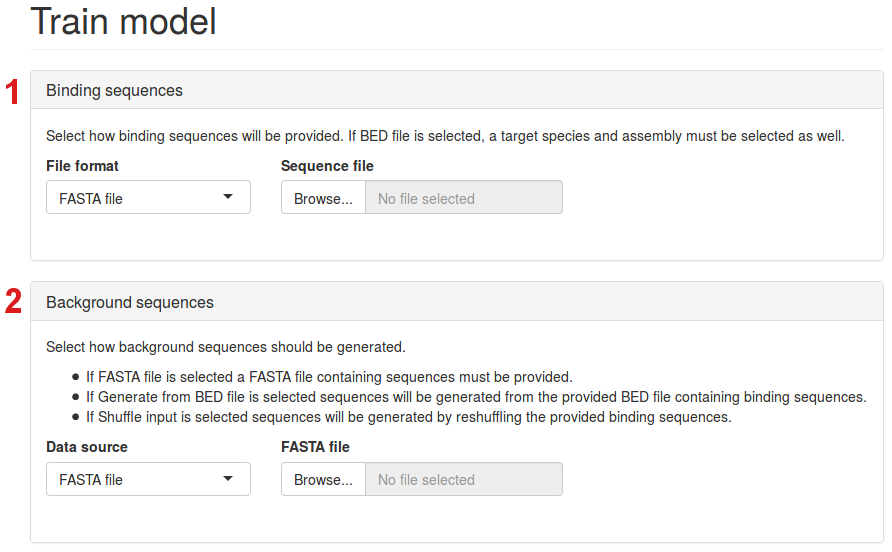
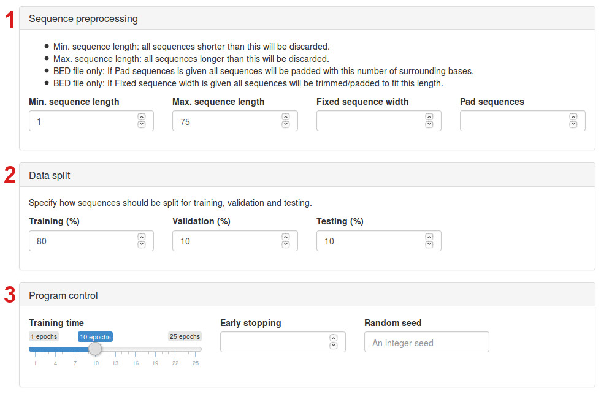

<h1 class="mt-3">DeepCLIP user guide</h1>

-----------------------------------------

Welcome to the DeepCLIP webpage. With this tool, you can use already trained models or train you own small models to predict binding preferences of RNA-binding proteins.

{: .img-thumbnail}

From the navigation bar you can choose between:

1. Train model
2. Pre-trained models

## Using a pre-trained network

We will first use one of the pre-trained models for prediction. Select `Pre-trained models` from the navigation bar.

{: .img-thumbnail}

Browse the model table or use the search field to find the model you want to use. Then press `Use model` in the corresponding row to load that model.

### Model summary

Once you have selected a model, you will be directed to the model summary page.

1. Click the `Start over` button close the model view and start training a new model.
2. This panel contains a summary overview of the model.
3. You can download the foreground sequences (binding sequences) and background sequences that were used to train the model.
4. Figures showing: ROC curve of the best model’s predictions, filters of its convolutional layers (values left of the filter-logos are information content per base) and the distribution of the predictions. In the bottom left corner, you can download the entire figure.

### Prediction

When you press the `Prediction` tab, the following panel will appear.

{: .img-thumbnail}

1. Upload a FASTA file with sequences you want to predict. If a pre-trained model is used, the sequences must have a length of min. 12 bp and max. 75 bp. Both DNA sequences and RNA sequences can be uploaded.
2. Write sequences manually. Remember to keep the FASTA format (see example above). Note that it does not matter whether your sequences are DNA or RNA, upper case or lower case. Drag the lower right corner with your mouse to change the size of the text area.
3. Enable prediction in paired sequence mode.
4. Run prediction. When prediction is done the results will appear below the button.

### Prediction results

Below you see the results of the predictions on the two sequences; `seq 1` and `seq 2`.

{: .img-thumbnail}

1. The sequence IDs, sequences and scores (predictions) can be downloaded as a CSV file or Excel table.
2. You can select a predicted sequence and the binding profile of the sequence will appear below. Here, `seq 1` has been selected. You can see the id, sequence and score (prediction).
3. Search for a specific predicted sequence.
4. The binding profile plot. Along the first axis the sequence is shown and along second axis the class association for the different sequential areas are shown; DeepCLIP scores close to 1 indicate class 1 (CLIP sequences) and DeepCLIP scores close to -1 indicate class 0 (background sequences).
5. Download the binding profile of the selected predicted sequence.

### Running in paired sequence mode

Toggle the `Predict paired sequences` (1) switch to enabled paired sequence mode.

{: .img-thumbnail}

In paired sequence mode, you can check the binding affinity change of a given protein when mutations are introduced to a sequence.

Upload or paste the variant sequences you want to compare reference sequences (2). Note that the sequences you want to compare should have identical lengths.

### Paired sequence results

Shown below are the results from the prediction in paired sequence mode. In this example, `seq 1` and `seq 2` were paired against the variant sequences seq 3 and seq 4, respectively.

{: .img-thumbnail}

On the binding profile you can see that the `U>C` single nucleotide polymorphism weakens a potential hnRNP C binding site.

1. Now the ids, the sequences and scores are shown for both the reference sequence and the variant sequence.
2. The variation(s) of the variant sequence is shown below the reference sequence.
3. Activate profile difference mode.

### Paired sequence results - profile difference only

Toggle the `Plot profile difference` switch to enable profile difference model.

{: .img-thumbnail}

In this mode, it is possible to see the difference between the binding profiles of the reference sequences and the variant sequences. If the red line follows the blue line, there is no predicted affinity change. The binding profiles of the reference sequences (black lines) are plotted on top of the blue and red lines.

## Train new model

Choose "Train model" from the navigation bar to open the model training panel.

### Sequence data

First you upload the sequences you wish to use for training the DeepCLIP model.

{: .img-thumbnail}

1. Choose between DNA or RNA sequences, choose between FASTA or BED files, upload binding sequences of the selected file format. If BED file format is chosen, a dropdown menu called "Assembly" will appear next to the "Sequence file" dropdown menu. Here, you can choose between different reference genomes.
2. Upload or generate background sequences. In the "Data source" tab, you can either choose to upload background sequences as a FASTA file, generate them randomly from the reference genome or shuffle the binding sequences.

### Model parameters

{: .img-thumbnail}

1. Here, you can decide the min. and max. length of input sequences. Also, you can decide if sequences should have identical lengths and whether they should be padded with zeros.
2. You can decide the sizes of the training, validation and testing set.
3. Choose the number of epochs, the number of epochs the model is allowed to train without improvements before it stops (early stopping) and an optional random seed.
4. Finally, press the "Train model" button to start the training.
